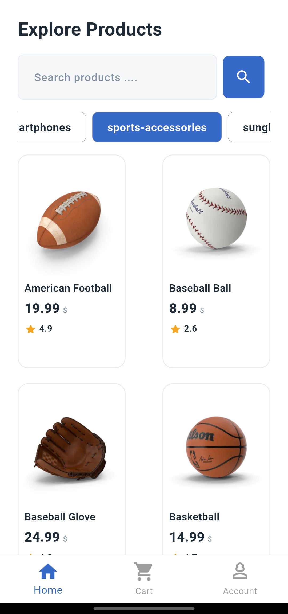
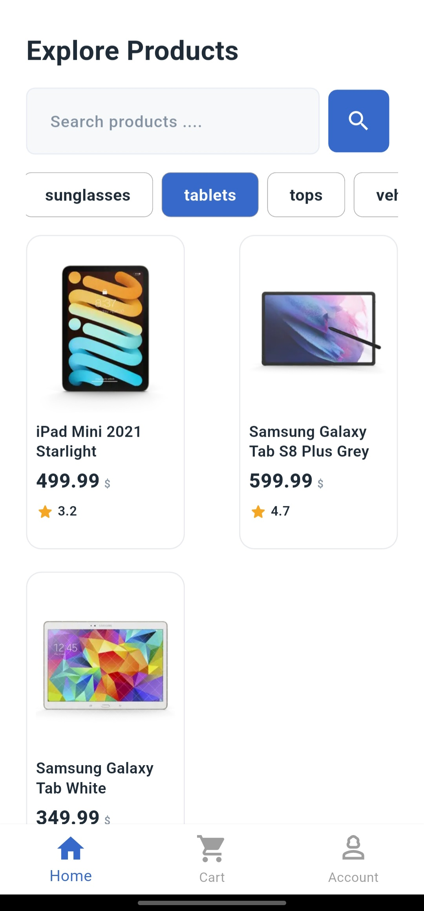
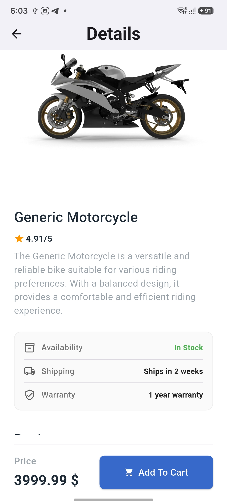
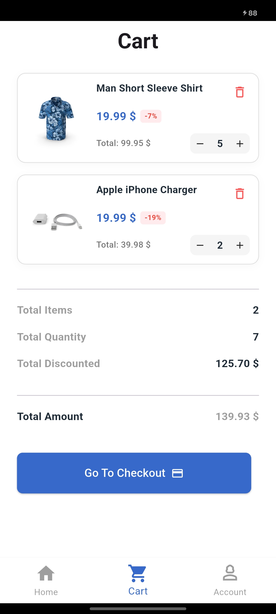
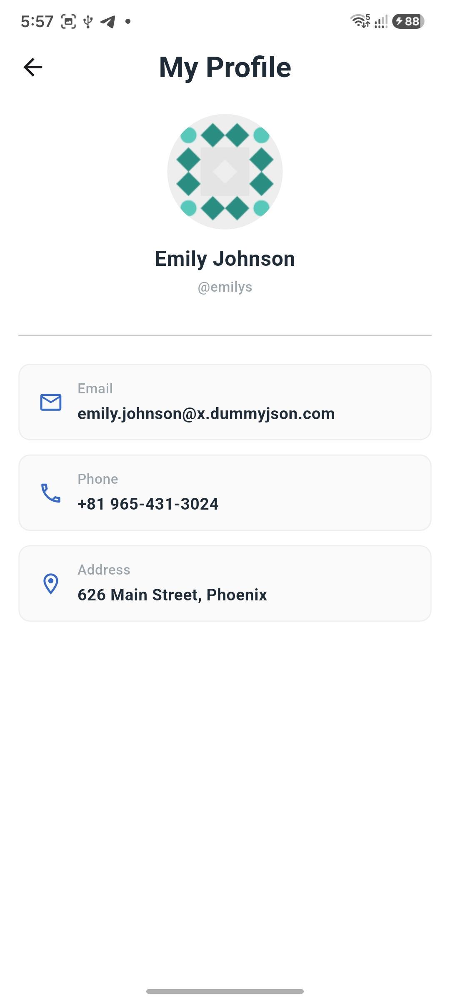
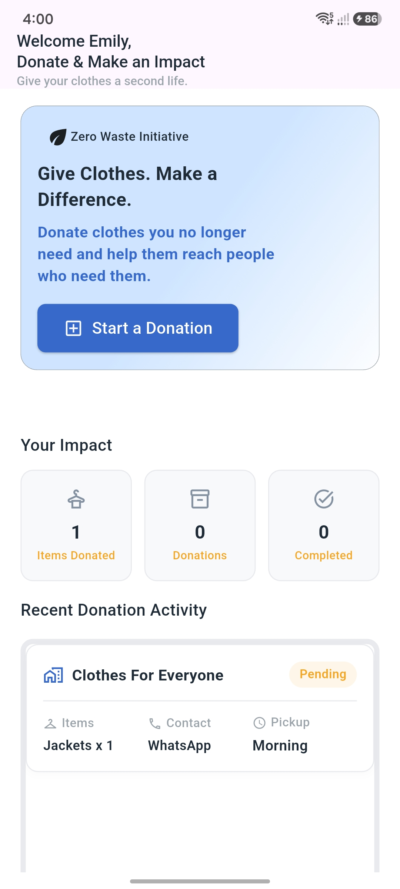
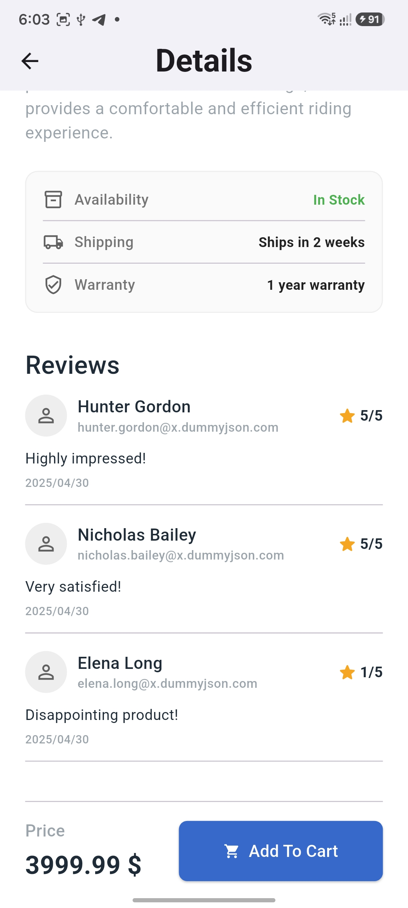
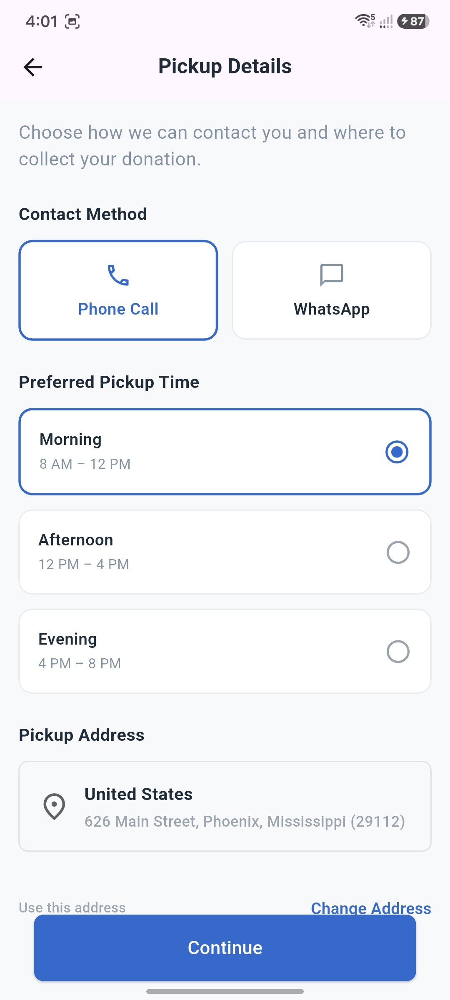
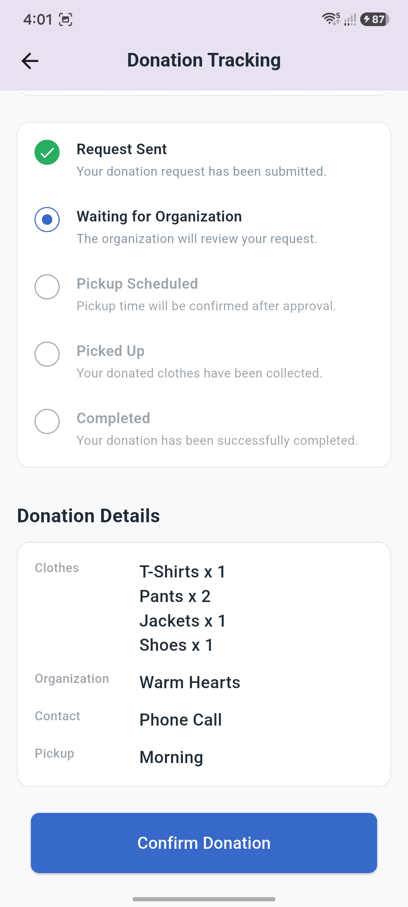

# 🛒 Flutter E-Commerce & Donation Application

A modern E-Commerce mobile application built with **Flutter**, demonstrating **Clean Architecture-inspired principles**, **BLoC/Cubit** state management, secure token handling, responsive UI, and local data persistence.

This project uniquely combines a traditional E-Commerce experience with a **Clothing Donation feature**, allowing users to donate clothes to selected organizations and track their donation status locally.

---

## ✨ Key Features

* **📱 Splash & Onboarding**
  Smooth application startup experience with Lottie animations.
* **🔐 Secure Authentication**
  Login and registration with **Access & Refresh Token** handling using Dio interceptors and secure local storage.
* **🛍️ Dynamic Home Feed**
  Browse products and categories loaded from the API with shimmer loading and staggered animations.
* **📦 Product Details & Search**
  Interactive product details, search flows, and reviews.
* **🛒 Shopping Cart**
  Cart management integrated with the application's state management architecture.
* **👤 User Profile & Address**
  User information and address management with dedicated Cubit state management.
* **🎁 Clothing Donation (Social Impact Flow)**
  A complete multi-step wizard allowing users to select clothing items, choose an organization, pick contact/pickup preferences, and track the request.
* **💾 Local Donation Persistence**
  Donation requests are stored locally using **Hive**, allowing donation history and tracking data to persist seamlessly between application sessions.
* **🌐 Network Monitoring**
  Global internet connectivity monitoring using `connectivity_plus` and a custom `NetworkListenerWrapper`.
* **🔄 Token Refresh Handling**
  Automatically handles expired access tokens through a custom Dio interceptor and refresh-token flow without forcing user logouts.
* **✨ UI Animations & Loading States**
  Lottie animations, shimmer placeholders, cached images, and staggered UI animations for a premium user experience.

---

## 🎁 Clothing Donation Feature

The application extends its functionality with a social-impact donation flow, designed with a stateless UI and deferred data persistence.

### 🔄 Donation Flow

```text
Donation Home
     │
     ▼
Select Clothes
     │
     ▼
Choose Organization
     │
     ▼
Contact & Pickup
     │
     ▼
Review Donation
     │
     ▼
Submit Donation (Persisted to Hive)
     │
     ▼
Donation Tracking

```

### 📊 Donation Lifecycle

The current implementation tracks the donation workflow locally across three core stages:

```text
Pending  ─────►  Accepted  ─────►  Completed

```

> **Note:** The current implementation uses **Hive** for local persistence to simulate the donation workflow. The architecture is modularly designed so that the local data source can be seamlessly replaced with a remote backend (for real-time status synchronization, organization dashboards, and notifications) in future iterations.

---

## 🏛️ Architecture

The project follows a **Feature-Based, Clean Architecture-inspired structure** with a clear separation between presentation, state management, and data handling.

### Architecture Layers

* **Presentation Layer:** Screens, Widgets, and UI state handling.
* **State Management (Cubit):** Manages UI states, triggers data operations, and holds in-memory session data for multi-step flows.
* **Data Layer:**
* **Repositories:** Used for remote API communication (e.g., E-commerce features).
* **Local Data Sources:** Used for direct local database operations (e.g., Hive operations for Donations).
* **Models:** Strongly typed data models and Enums.


### 🔄 Deferred Local Persistence (Donation Flow)

For the multi-step donation feature, the selected data is maintained purely in-memory (RAM) within the `DonationCubit` while the user navigates the flow. The data is persisted to Hive **only** after the user confirms the final review. This guarantees data integrity and prevents incomplete or orphan records in the local database.

### 📁 Project Structure

```text
lib/
├── core/
│   ├── constants/        # App-wide static values
│   ├── networking/       # Dio helper, Interceptors & Network Cubit
│   ├── routing/          # GoRouter configuration & routes
│   ├── styling/          # Colors, Fonts, Theme & Assets
│   ├── utils/            # Service locator (GetIt) & Local Storage
│   └── widgets/          # Reusable shared UI components
│
├── features/
│   ├── account/          # User account settings
│   ├── address/          # User addresses management
│   ├── auth/             # Login & Register flows
│   ├── cart/             # Shopping cart management
│   ├── home_screen/      # Dynamic feed, Categories & Products
│   ├── main_screen/      # Bottom navigation wrapper
│   ├── product_screen/   # Product details view
│   ├── profile/          # User profile data
│   ├── search/           # Search functionality
│   ├── splash/           # Initial app loading screen
│   │
│   └── donation/         # 🎁 Clothing Donation Module
│       ├── cubit/        # Donation state management
│       ├── data/         
│       │   ├── data_sources/  # Hive local data source
│       │   └── models/        # Data models & Hive adapters (.g.dart)
│       └── screens/      # Multi-step donation wizard screens
│
└── main.dart             # Application entry point

---

## 🔐 Authentication & Token Management

Authentication relies on Access and Refresh Tokens, securely stored using `flutter_secure_storage`. A custom Dio interceptor handles token expiration silently:

```text
API Request ──► Dio Interceptor
                     │
                     ├── 200 OK ──► Response
                     │
                     └── 401 Unauthorized
                              │
                              ▼
                        Refresh Token API
                              │
                              ▼
                        Save New Tokens
                              │
                              ▼
                      Retry Original Request

```

---

## 🛠️ Tech Stack

**Architecture & State Management**

* `flutter_bloc` — BLoC/Cubit state management
* `get_it` — Dependency Injection / Service Locator
* `dartz` — Functional error handling with Either
* `equatable` — Value equality for states

**Networking & Security**

* `dio` — HTTP networking
* `pretty_dio_logger` — Network request/response logging
* `flutter_secure_storage` — Secure token storage
* `connectivity_plus` — Network connectivity monitoring

**Local Persistence**

* `hive` & `hive_flutter` — Local NoSQL database
* `hive_generator` & `build_runner` — TypeAdapter generation

**Routing & UI**

* `go_router` — Declarative routing
* `flutter_screenutil` — Responsive UI layouts
* `cached_network_image` — Efficient image caching
* `shimmer` & `lottie` — Loading skeletons and vector animations
* `animated_snack_bar` — Animated application feedback

---

## 📸 Screenshots

### E-Commerce Features
| Home Screen | Home Screen | Product Details | Cart & Profile & Search |
|:---:|:---:|:---:|:---:|
|  |  |  |  |
|  |  | | |

### Donation Features
| Donation Home | Select Clothes | Contact & Pickup | Donation Tracking |
|:---:|:---:|:---:|:---:|
|  |  |  |  |

---

## 🚀 Getting Started

### Prerequisites

* Flutter SDK (Latest Stable)
* Dart SDK

### Installation

1. Clone the repository:
```bash
git clone [https://github.com/YoussefNasr2005/Ecommerce_app.git](https://github.com/YoussefNasr2005/Ecommerce_app.git)

```


2. Navigate to the project:
```bash
cd Ecommerce_app

```


3. Install dependencies:
```bash
flutter pub get

```


4. Generate Hive TypeAdapters:
```bash
dart run build_runner build --delete-conflicting-outputs

```


5. Run the application:
```bash
flutter run

```

---

## 🎯 Project Goals

This project was built to practice and demonstrate:

* Structuring large-scale Flutter apps using feature-based architecture.
* Managing complex state using BLoC/Cubit.
* Handling tokens securely with Dio interceptors.
* Implementing seamless local data persistence with Hive.
* Building responsive, highly-polished user interfaces.

## 🔮 Future Improvements

Since the donation feature is currently implemented using local persistence, future iterations aim to introduce:

* A remote backend for real-time donation status synchronization.
* Dedicated organization dashboards and accounts.
* Push notifications for pickup scheduling updates.
* Cross-device donation history synchronization.

---

**👨‍💻 Author**

**Youssef Nasr**

Flutter Developer focused on building clean, scalable, and user-friendly mobile applications.

* [GitHub: YoussefNasr2005](https://github.com/YoussefNasr2005?utm_source=gemini)
* [Portfolio](https://www.google.com/search?q=https://youssefnasr2005.github.io&utm_source=gemini)

```

```
